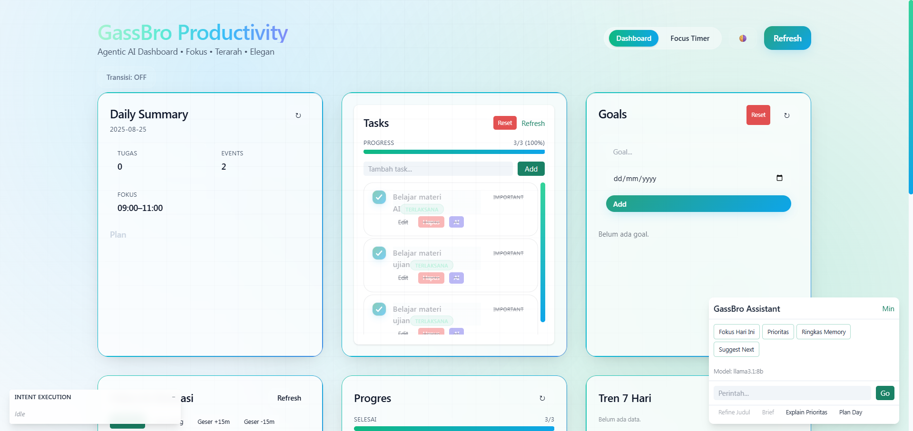
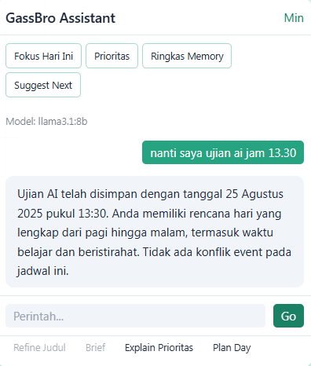
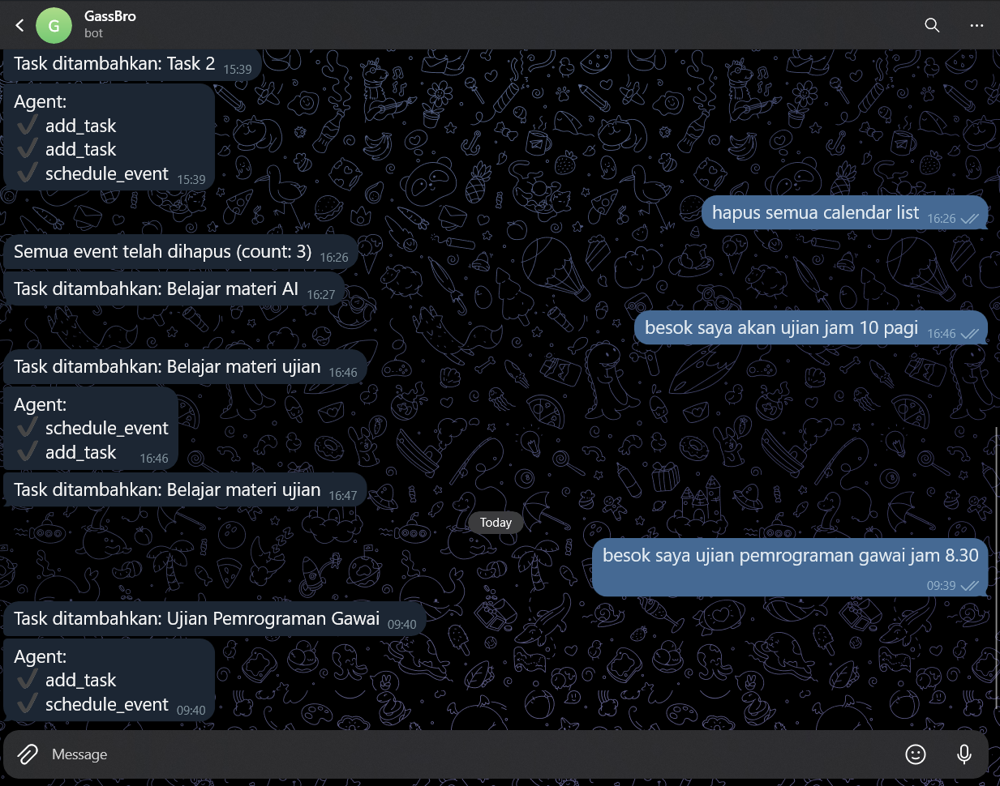

# 🚀 GassBro – Agentic AI Productivity Dashboard

 <!-- Ganti dengan banner milikmu -->

[](LICENSE)
[](https://nodejs.org/)
[](https://supabase.com/)
[](https://ollama.com/)

---

> **GassBro** adalah asisten produktivitas berbasis AI agentic yang mampu merencanakan, mengeksekusi, dan merefleksi aktivitas harian Anda secara otomatis dan proaktif.  
> **Ditenagai LLM lokal (Ollama),** GassBro memahami perintah natural (Bahasa Indonesia), mengelola tugas, jadwal, dan fokus harian, serta memberikan insight dan rekomendasi personal.

---

## ✨ Fitur Unggulan Agentic AI

| Fitur                | Deskripsi                                                                 |
|----------------------|---------------------------------------------------------------------------|
| **Plan → Act → Reflect** | AI merencanakan, mengeksekusi, dan refleksi otomatis setiap hari.         |
| **Natural Language** | Input perintah bebas (chat/Telegram/UI) → AI mengubah jadi aksi nyata.     |
| **Proaktif & Adaptif** | Otomatis menjadwalkan fokus, deteksi konflik, dan memberi saran perbaikan. |
| **Memori Kontekstual** | Setiap interaksi dicatat & dipakai untuk keputusan berikutnya.             |
| **Refleksi Otomatis** | Evaluasi & insight harian, rekomendasi perbaikan, dan tren progres.         |
| **Integrasi Telegram** | Kontrol penuh lewat chat: tambah task/event, reset massal, perintah natural.|
| **Panel Eksekusi Real-Time** | Lihat niat, progres, dan hasil setiap aksi agent secara langsung.         |

---

## 🖥️ Demo Dashboard

 <!-- Ganti dengan GIF/screenshot dashboard -->

---

## 🛠️ Setup & Instalasi

### 1. **Prasyarat**
- Node.js v18+
- PostgreSQL (Supabase)
- [Ollama](https://ollama.com/) (LLM lokal, misal `llama3`)
- Ngrok (untuk webhook Telegram, opsional)

### 2. **Clone Repo**
```bash
git clone https://github.com/USERNAME/REPO.git
cd GassBro
```

### 3. **Setup Environment**
Salin `.env.example` ke `.env` di folder `server` dan isi:
```env
SUPABASE_URL=... 
SUPABASE_SERVICE_KEY=...
OLLAMA_URL=http://localhost:11434/api/generate
OLLAMA_MODEL=llama3
TELEGRAM_BOT_TOKEN=...
TELEGRAM_CHAT_ID=...
```

### 4. **Install Dependency**
```bash
cd server
npm install
cd ../client
npm install
```

### 5. **Jalankan LLM Ollama**
```bash
ollama pull llama3
ollama serve
```

### 6. **Jalankan Server & Client**
```bash
# Terminal 1
cd server
npm run dev

# Terminal 2
cd client
npm run dev
```

### 7. **(Opsional) Setup Telegram Webhook**
- Jalankan ngrok: `ngrok http 4000`
- Set webhook:
  ```
  https://api.telegram.org/bot<YOUR_TOKEN>/setWebhook?url=https://xxxx.ngrok-free.app/telegram/webhook
  ```

---

## 🧠 **Penjelasan Agentic AI di GassBro**

GassBro menerapkan konsep **agentic AI**:
- **Otonom**: Merencanakan, mengeksekusi, dan merefleksi tanpa instruksi manual berulang.
- **Kontekstual**: Menggunakan memori dan insight refleksi untuk adaptasi keputusan berikutnya.
- **Proaktif**: Menawarkan solusi, mengingatkan, dan menyesuaikan jadwal secara otomatis.
- **Transparan**: Setiap aksi agent dapat dipantau real-time oleh user.

---

## 📋 **Fitur Utama Lainnya**
- Manajemen Tasks, Events, Goals, Notes (Supabase)
- Penjadwalan otomatis & deteksi konflik + saran reschedule
- Pemecahan tugas besar menjadi subtasks
- Notifikasi Telegram (summary, reminder, evaluasi)
- Dashboard UI modern (React + Tailwind) + Dark Mode
- Chat Assistant Panel (perintah cepat)
- Reset massal via UI/Telegram
- Progress & trend analytics (rasio harian, stagnan, insight)

---

## 📸 **Tangkapan Layar**
| Dashboard | Panel Eksekusi | Telegram |
|-----------|----------------|----------|
|  |  |  |

---

## 📄 **Lisensi**
Hanif Abdul Karim Afandi - 2221101794
III RPLK

---

> _GassBro: Bukan sekadar to-do list, tapi asisten produktivitas agentic yang benar-benar membantu Anda berkembang!_

---

<!--
Tips:
- Ganti semua link gambar dengan screenshot/GIF milikmu agar lebih hidup.
- Tambahkan badge lain (build passing, stars, dsb) jika repo sudah publik.
- Untuk animasi, bisa pakai GIF hasil rekaman dashboard/fitur utama.
-->